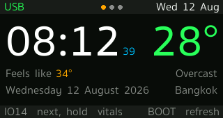
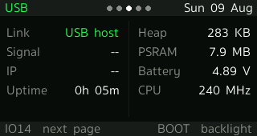
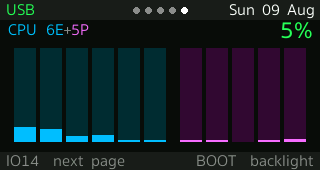

# T-Display-S3 desk panel

A LilyGO T-Display-S3 on a desk, showing the handful of things worth a glance
while you work: the time and the weather, how much of the Claude Code usage
window is left, what the Mac beside it is doing, and a banner the Mac can raise
when something actually needs you.

It runs off the USB-C cable with no WiFi at all — the host does the fetching on
the panel's behalf over the same serial link that carries the console. WiFi is
there as a fallback, not a requirement.

| | |
|---|---|
|  |  |
| **now** — time, date, temperature, conditions | **usage** — the 5h and 7d windows, and when they roll |
|  |  |
| **system** — the panel's own link, memory, battery | **mac** — charge, load, memory, disk |
|  | |
| **cpu** — every logical core, E cluster then P | |

`IO14` moves to the next page. `BOOT` refreshes the page's data where that means
something, and toggles the backlight where it doesn't.

## How the pieces fit

```
   ┌─────────────────┐                       ┌──────────────────────────────┐
   │  T-Display-S3   │                       │            macOS             │
   │                 │   USB-C, CDC serial   │                              │
   │  dashboard  ────┼───────────────────────┤  usb_net_bridge.py           │
   │  net_link       │  @REQ / @RES framing  │    ├── PING  liveness        │
   │                 │                       │    ├── TIME  stands in for   │
   │                 │                       │    │         NTP            │
   │                 │                       │    └── GET   fetches on the  │
   └─────────────────┘                       │              panel's behalf  │
            │                                │              │               │
            │ WiFi, only if the bridge       │              ├─→ the internet│
            │ is not answering               │              │   (Open-Meteo)│
            └────────────────────────────────┤              │               │
                                             │              ├─→ :8787 usage │
                                             │              └─→ :8789 mac   │
                                             └──────────────────────────────┘
```

The panel does not know or care which link it got. `net_link.h` picks whichever
one is answering, preferring the cable; the status bar says which.

**Why a request bridge and not IP over USB.** The Arduino core's TinyUSB is built
without the NCM/ECM classes and its lwIP without PPP, so the panel has no way to
put packets on the cable. Moving *requests* instead needs nothing the stock core
does not already have.

## Hardware

LilyGO T-Display-S3 — ESP32-S3 with 16 MB flash and 8 MB PSRAM, driving a
320×170 ST7789 over an 8-bit parallel (i8080) bus. No wiring: every pin is fixed
on the board and declared in `platformio.ini`.

Two things about it that cost an evening each if you don't know them:

- **GPIO15 gates the LCD rail.** It must be driven high before `tft.init()` or
  the panel never lights up, whatever else is right.
- **The display setup lives in `build_flags`,** not in TFT_eSPI's `User_Setup.h`.
  `-DUSER_SETUP_LOADED` tells the library to use ours. Editing `User_Setup.h`
  under `.pio/libdeps/` does nothing and is erased on the next dependency fetch.

## Getting it running

```bash
python3 -m venv .venv && .venv/bin/pip install platformio pyserial pillow freetype-py
cp include/secrets.h.example include/secrets.h    # then edit it
.venv/bin/pio run -e dashboard -t upload
```

`secrets.h` holds the WiFi credentials, where the two host servers live, and the
location and timezone for the clock and weather. It is gitignored; the example
beside it is not. Leaving the WiFi placeholders as they are is a supported
configuration — the panel then runs on the cable alone.

There is a second environment for bringing up a new board:

```bash
.venv/bin/pio run -e selftest -t upload      # backlight, colour, bus, buttons
```

## The host side

Three Python programs, all installed as launch agents. The plists sit beside
each script and carry their own install instructions in a comment at the top.

| | port | what it does |
|---|---|---|
| `tools/usb_net_bridge.py` | 8788 | Answers the panel's requests over the cable. Needs pyserial; **replaces** `pio device monitor`, since it holds the port. |
| `tools/usage_server.py` | 8787 | Serves the Claude Code 5h/7d limits. Stdlib only. |
| `tools/mac_stats_server.py` | 8789 | Serves battery, load, memory, disk, per-core CPU, and the notification mailbox. Stdlib only. |

The two servers run on the **system** python on purpose — stdlib only, so they
keep working when the project venv is rebuilt or deleted.

They each run a *copy* of their script, from `~/Library/Application Support/`,
because `~/Desktop` is TCC-protected and a launch agent pointed straight at it
dies on startup with "Operation not permitted". **After editing a server, copy
it across and kick the agent** — the plist comments give the exact commands.

### The two scripts that live in ~/.claude

These are installed outside the repo but the panel depends on them, so copies
are kept here:

- **`tools/statusline.sh`** — the Claude Code status line. It writes
  `~/.claude/statusline-usage.cache`, which is the only place the usage numbers
  survive outside a running session, and therefore the only thing
  `usage_server.py` has to read. No cache, no usage page.
- **`tools/panel-notify.sh`** — wired to four Claude Code hooks; raises and
  retracts the banner. This is what makes the banner worth having.

Copy them to `~/.claude/` and point `settings.json` at them.

## Notifications

`mac_stats_server.py` holds one message. Anything on the machine can post one
and the panel raises it over whatever page is showing, flashing the backlight,
until a button acknowledges it:

```bash
curl -sf -X POST localhost:8789/notify -d 'msg=build failed' -d kind=warn -d ttl=30
```

`kind` is `info`, `warn` or `alert` and picks the colour. `ttl` is seconds, `0`
meaning until dismissed — the default for `alert`, which is the difference
between an alert and a note. Posting an empty message retracts. Posting is
loopback-only; everything else the server does is read-only and served to the
subnet.

Messages are squeezed to printable ASCII, because that is all the fonts carry.

## Fonts

The three smooth fonts are generated from a system TTF into TFT_eSPI's VLW
format and checked in as C headers:

```bash
.venv/bin/python tools/make_vlw.py \
    /System/Library/Fonts/Supplemental/SukhumvitSet.ttc \
    16 src/fonts/ui16.h UiFont16 --face 2 --set ascii
.venv/bin/python tools/preview_vlw.py src/fonts/ui16.vlw /tmp/ui16.png "20:45  28°"
```

`make_vlw.py` writes the raw `.vlw` beside the header so `preview_vlw.py` can
check what was actually emitted rather than re-deriving it from the TTF. Only
the headers are checked in — the `.vlw` files are build byproducts and
gitignored, so regenerate before previewing a fresh clone.

The glyph set is printable ASCII plus the degree sign. That is a real constraint
and it reaches further than it looks: the middle dots on the usage and Mac pages
are *drawn* rather than typed, and `mac_stats_server.py` substitutes non-ASCII
out of notification text before storing it.

Thai works, but only with a font whose combining marks already carry
`xAdvance == 0` and a negative `dX` — TFT_eSPI does no OpenType shaping.
Sukhumvit Set does; Thonburi does not. See the comment in `make_vlw.py`.

## Talking to a running panel

The firmware takes single-byte commands on the console, and
`tools/grab_screen.py` uses them to pull the actual framebuffer — not a mock-up
of it — as a PNG:

```bash
.venv/bin/python tools/grab_screen.py shot 5      # capture all five pages
```

| | |
|---|---|
| `N` | next page |
| `S` | dump the framebuffer as raw RGB565 |
| `A` | toggle automatic page selection |

While the bridge is running it owns the serial port, so `grab_screen.py` talks
to the bridge's passthrough socket instead. Uploads pause the bridge
automatically — `pio_bridge_pause.py` is registered as a pre-upload hook in
`platformio.ini`, so `pio run -t upload` just works with the bridge up.

## Tests

```bash
./tests/run.sh
```

No board, no PlatformIO — just a C++17 compiler. It covers `layout.h`, which is
where the two pieces of arithmetic worth being wrong about live: the banner's
word wrap and the CPU page's column sizing.

Two things make it worth having rather than decorative.

It tests the **firmware's own code**. `layout.h` is templated on the string type
and on the function that measures text, which are the only two things that
cannot leave the device, so the test compiles the same header the panel does
rather than a copy that quietly drifts.

And it measures text with **TFT_eSPI's real algorithm over the real fonts** —
`textWidth` transcribed from the library, reading metrics out of the generated
`.vlw` files. That is not pedantry: the width of a string is not the sum of its
characters' widths. The first glyph's negative left bearing is added back and
the last contributes its ink extent rather than its advance, so a wrap checked
against a simpler model passes on the host and overflows on the panel.

What it asserts, over a corpus and 200,000 random inputs at the banner's real
280px: no line exceeds its box, no line is empty or carries a stray space, the
line count is respected, and the characters that come out are the characters
that went in — entire when the text fitted, a prefix when it was cut, with the
loss marked. Then that every core count from 1 to `MAX_CORES` lands on the panel
in full, and that eleven cores still come out at the 22px this was built around.

The suite has been checked against deliberate breakage — lines allowed to run
over, bars pinned back to a fixed width, the truncation marker dropped, a
character lost per word, a stray separator, an off-by-one on the line limit —
and each is caught by a different assertion.

The `.vlw` files are gitignored build byproducts; regenerate them with
`make_vlw.py` before running the tests on a fresh clone. The test says so if
they are missing.

## What the panel decides for itself

It picks its own page: to the CPU page when the Mac's load passes three quarters
of its core count, to the usage page when a window goes over 85%. Any button
hands control back for two minutes; `A` turns it off entirely. The lit dot in
the status bar says which mode it is in — cyan for automatic, warm while you
have it, white when automatic is off.

It also dims after sunset, using the sunrise and sunset from the weather
forecast rather than a hardcoded pair of hours. It never blanks: the hours the
Mac is locked, asleep or shut in a clamshell are exactly the hours nothing else
on the desk is showing the time.

## Notes for later

Known and deliberately not done yet:

- No watchdog. A panel meant to stay up for weeks should have one.
- `mac.screen` is fetched and unused, left from when the panel followed the
  Mac's own display.
- The two servers bind `0.0.0.0` with no auth. Read-only, but it does put
  "screen: locked" on the subnet.
