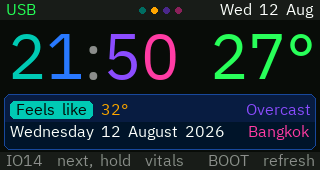
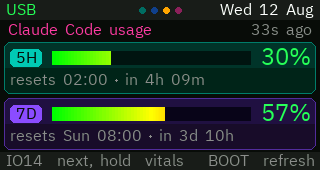
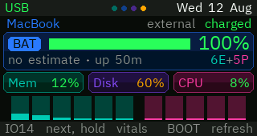
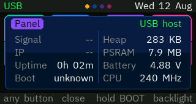

# T-Display-S3 desk panel

A LilyGO T-Display-S3 on a desk, showing the handful of things worth a glance
while you work: the time and the weather, how much of the Claude Code usage
window is left, what the Mac beside it is doing, and a banner the Mac can raise
when something actually needs you.

It runs off the USB-C cable with no WiFi at all — the host does the fetching on
the panel's behalf over the same serial link that carries the console. WiFi is
there as a fallback, not a requirement.

| | |
|---|---|
|  |  |
| **flip** — a split-flap clock, and how warm it is | **now** — time, date, temperature, conditions |
|  |  |
| **usage** — the 5h and 7d windows, and when they roll | **mac** — charge, screen, memory, disk, a column per core |
|  | |
| **vitals** — not a page: hold `IO14` for the panel's own | |

`IO14` moves to the next page, and held, brings up the panel's own vitals over
whatever is showing. `BOOT` refreshes the page in front of you, and held, dims
or brightens the panel.

The two clock pages are not a duplicate. **flip** is what the panel comes to
rest on once the Mac's screens go dark, and the hours it spends there are the
hours nobody is reading anything: what a page has to do at a quarter brightness
from the far side of a dark room is be legible from the doorway, which four
cards 88px tall manage and a date, a place and a line of forecast in 16px type
do not. It carries the temperature and what it feels like underneath, at a size
you have to come closer for, because that is the second question and not the
first. Everything it leaves out, **now** still has, one press to the right.

A card that changes folds rather than simply becoming the new digit — the old
one down over the fresh half waiting underneath, then the new lower half up out
of the seam. Nothing rotates a bitmap: the leaf is the same card face drawn
through a viewport that closes onto the seam and opens again below it, dimming
as it goes, which at this size is what a fold looks like. It is the only thing
on the panel drawn as an animation rather than as a state, so it is also the
only thing that borrows a faster frame — 40 ms for the third of a second it is
in flight, and back to the usual once a second after.

The vitals are behind a hold rather than in the cycle because every figure on
them answers "is this thing working" — a question you ask on purpose after
noticing something wrong, never one you answer in a glance. As a page they cost
a press on every trip round to skip past three constants and two fields that
read `--` whenever the link is the cable.

## Two questions, two ramps

The four colours of the flip clock's cards are the colours of the whole panel.
They started there because a split-flap board needs its cards told apart and a
`4` is not worse than a `3` — and that turned out to be the thing every other
page wanted too. The 7d window is not worse than the 5h one, disk is not worse
than memory, and a P core at 90% is not a warning; it is a P core doing its job.

So there are two ramps and they never overlap. **Teal, blue, violet, magenta**
says *which reading this is*: the card it is on, the chip that labels it, the
column it belongs to, the dot in the status bar you would press to get back to
it. **Green, orange, red** says *how that reading is doing*, and is kept for the
figures that are actually graded — the percentage, the temperature, the charge.
A page can then answer both at once, where colouring by severity alone left the
usage page as two identical grey rows and the Mac page as one long line divided
by hairlines.

Cards are what carry the first ramp. The same two-tone body as a flip card and
the same rounded corners, at a quarter of the strength, because a card with an
88px digit on it can be its hue at full and one carrying a bar, a percentage and
a line of small print has to sit behind all three. The label on it is the one
place the hue comes back at full: a dark word in a saturated lozenge, which is
also how the clock's own digits sit on their cards. Text on a card is drawn
transparent, blended against whatever is under it, which is what lets a string
cross the seam in the middle of a card without being boxed in the wrong half's
shade.

The clock on the **now** page is drawn a glyph at a time so its four digits can
take the ramp in the order the cards do. It is the same reading as the page to
its left and the colours are what say so.

## How the pieces fit

```
   ┌─────────────────┐                       ┌──────────────────────────────┐
   │  T-Display-S3   │                       │            macOS             │
   │                 │   USB-C, CDC serial   │                              │
   │  dashboard  ────┼───────────────────────┤  usb_net_bridge.py           │
   │  net_link       │  @REQ / @RES framing  │    ├── PING  liveness        │
   │                 │                       │    ├── TIME  stands in for   │
   │                 │                       │    │         NTP            │
   │                 │                       │    └── GET   fetches on the  │
   └─────────────────┘                       │              panel's behalf  │
            │                                │              │               │
            │ WiFi, only if the bridge       │              ├─→ the internet│
            │ is not answering               │              │   (Open-Meteo)│
            └────────────────────────────────┤              │               │
                                             │              ├─→ :8787 usage │
                                             │              └─→ :8789 mac   │
                                             └──────────────────────────────┘
```

The panel does not know or care which link it got. `net_link.h` picks whichever
one is answering, preferring the cable; the status bar says which.

**Why a request bridge and not IP over USB.** The Arduino core's TinyUSB is built
without the NCM/ECM classes and its lwIP without PPP, so the panel has no way to
put packets on the cable. Moving *requests* instead needs nothing the stock core
does not already have.

## Hardware

LilyGO T-Display-S3 — ESP32-S3 with 16 MB flash and 8 MB PSRAM, driving a
320×170 ST7789 over an 8-bit parallel (i8080) bus. No wiring: every pin is fixed
on the board and declared in `platformio.ini`.

Two things about it that cost an evening each if you don't know them:

- **GPIO15 gates the LCD rail.** It must be driven high before `tft.init()` or
  the panel never lights up, whatever else is right.
- **The display setup lives in `build_flags`,** not in TFT_eSPI's `User_Setup.h`.
  `-DUSER_SETUP_LOADED` tells the library to use ours. Editing `User_Setup.h`
  under `.pio/libdeps/` does nothing and is erased on the next dependency fetch.

## Getting it running

```bash
python3 -m venv .venv && .venv/bin/pip install platformio pyserial pillow freetype-py
cp include/secrets.h.example include/secrets.h    # then edit it
.venv/bin/pio run -e dashboard -t upload
```

`secrets.h` holds the WiFi credentials, where the two host servers live, and the
location and timezone for the clock and weather. It is gitignored; the example
beside it is not. Leaving the WiFi placeholders as they are is a supported
configuration — the panel then runs on the cable alone.

There is a second environment for bringing up a new board:

```bash
.venv/bin/pio run -e selftest -t upload      # backlight, colour, bus, buttons
```

## The host side

Three Python programs, all installed as launch agents. The plists sit beside
each script and carry their own install instructions in a comment at the top.

| | port | what it does |
|---|---|---|
| `tools/usb_net_bridge.py` | 8788 | Answers the panel's requests over the cable. Needs pyserial; **replaces** `pio device monitor`, since it holds the port. |
| `tools/usage_server.py` | 8787 | Serves the Claude Code 5h/7d limits. Stdlib only. |
| `tools/mac_stats_server.py` | 8789 | Serves battery, load, memory, disk, which screen is being driven, per-core CPU, and the notification mailbox. Stdlib only. |

The two servers run on the **system** python on purpose — stdlib only, so they
keep working when the project venv is rebuilt or deleted.

### Who they answer

Both bind all interfaces, because the panel's WiFi fallback needs to reach them
from the LAN. What that used to mean is that anything else on the network could
read them too — including `/notify`, whose text names project directories and
whatever Claude stopped to ask about.

So requests from **this machine** are served as they always were, which covers
every request over the USB bridge: the bridge does the fetching, so it arrives
from loopback. Requests from **the LAN** must carry `X-Panel-Token`. Posting a
notification stays loopback-only regardless.

The token is minted on first run and kept at `~/.config/t-display-s3/token`,
mode 0600, outside the repo. Copy it into `secrets.h` as `HOST_TOKEN` to let the
WiFi fallback work; leave the placeholder and the panel simply runs on the cable
alone. Clock and weather are unaffected either way — neither touches your
machine.

It is a shared secret over plain HTTP, so it is no defence against someone
reading the traffic, and is not meant to be. It stops the network being able to
just read the port.

They each run a *copy* of their script, from `~/Library/Application Support/`,
because `~/Desktop` is TCC-protected and a launch agent pointed straight at it
dies on startup with "Operation not permitted". **After editing a server, copy
it across and kick the agent** — the plist comments give the exact commands.

### The two scripts that live in ~/.claude

These are installed outside the repo but the panel depends on them, so copies
are kept here:

- **`tools/statusline.sh`** — the Claude Code status line. It writes
  `~/.claude/statusline-usage.cache`, which is the only place the usage numbers
  survive outside a running session, and therefore the only thing
  `usage_server.py` has to read. No cache, no usage page.
- **`tools/panel-notify.sh`** — wired to four Claude Code hooks; raises and
  retracts the banner. This is what makes the banner worth having. Its alerts
  carry a one-minute `ttl`: the thing they are waiting for is you answering in
  the terminal, and the retracting hooks catch that within a keystroke, so the
  only case the banner outlives is the one where nobody is coming.

Copy them to `~/.claude/` and point `settings.json` at them.

## Notifications

`mac_stats_server.py` holds one message. Anything on the machine can post one
and the panel raises it over whatever page is showing, flashing the backlight,
until a button acknowledges it:

```bash
curl -sf -X POST localhost:8789/notify -d 'msg=build failed' -d kind=warn -d ttl=30
```

`kind` is `info`, `warn` or `alert` and picks the colour. `ttl` is seconds, `0`
meaning until dismissed — the default for `alert`, which is the difference
between an alert and a note. Nothing waits forever even so: a banner with no
`ttl` of its own is taken down after ten minutes, and one that runs out
unanswered puts the panel back on its resting page rather than leaving it on
whatever the banner was covering. Posting an empty message retracts. Posting is
loopback-only; everything else the server does is read-only and served to the
subnet.

Messages are squeezed to printable ASCII, because that is all the fonts carry.

## Fonts

The four smooth fonts are generated from IBM Plex Sans Thai — vendored at
`tools/fonts/` under the SIL Open Font License — into TFT_eSPI's VLW format, and
checked in as C headers:

```bash
F=tools/fonts/IBMPlexSansThai-Regular.ttf
.venv/bin/python tools/make_vlw.py $F 16 src/fonts/ui16.h   UiFont16   --set ascii
.venv/bin/python tools/make_vlw.py $F 24 src/fonts/ui24.h   UiFont24   --set ascii
.venv/bin/python tools/make_vlw.py $F 64 src/fonts/big64.h  BigFont64  --set numeric
.venv/bin/python tools/make_vlw.py $F 88 src/fonts/flip88.h FlipFont88 --set numeric
.venv/bin/python tools/preview_vlw.py src/fonts/ui16.vlw /tmp/ui16.png "20:45  28°"
```

`--set numeric` is why the two big faces cost what they do and not more: the
flip clock only ever shows a digit or a dash, so baking the other ninety-odd
printable characters at 88px would be 37 KB of flash spent on glyphs nothing
can reach.

The font sits in the repo rather than being named as a path into
`/System/Library`. It used to be macOS's Sukhumvit Set, which made the headers
something only a Mac could regenerate and the glyphs inside them something
nobody could redistribute. Plex Sans Thai is one file carrying both the Latin
the panel shows and the Thai below, and the licence lets it travel with the
source.

`make_vlw.py` writes the raw `.vlw` beside the header so `preview_vlw.py` can
check what was actually emitted rather than re-deriving it from the TTF. Only
the headers are checked in — the `.vlw` files are build byproducts and
gitignored, so regenerate before previewing a fresh clone.

The glyph set is printable ASCII plus the degree sign. That is a real constraint
and it reaches further than it looks: the middle dots on the usage and Mac pages
are *drawn* rather than typed, and `mac_stats_server.py` substitutes non-ASCII
out of notification text before storing it.

Thai works, but only with a font whose combining marks already carry
`xAdvance == 0` and a negative `dX` — TFT_eSPI does no OpenType shaping. Plex
Sans Thai does, and so did Sukhumvit Set; Thonburi does not. The zero-advance
count `make_vlw.py` prints on the way out is that test in one number — a Thai
set reporting none will not stack. See the comment in `make_vlw.py`.

## Talking to a running panel

The firmware takes single-byte commands on the console, and
`tools/grab_screen.py` uses them to pull the actual framebuffer — not a mock-up
of it — as a PNG:

```bash
.venv/bin/python tools/grab_screen.py shot 4      # capture all four pages
```

It captures from wherever the panel is rather than from the first page, so which
page lands in `shot0.png` is whichever one it was resting on — the usage page
while somebody is at the Mac, the flip clock once its screens go dark.

| | |
|---|---|
| `N` | next page |
| `S` | dump the framebuffer as raw RGB565 |
| `A` | toggle automatic page selection |
| `V` | toggle the vitals overlay |

`V` exists because the overlay's own way in is a finger on a button, which is no
use to a host trying to photograph it.

While the bridge is running it owns the serial port, so `grab_screen.py` talks
to the bridge's passthrough socket instead. Uploads pause the bridge
automatically — `pio_bridge_pause.py` is registered as a pre-upload hook in
`platformio.ini`, so `pio run -t upload` just works with the bridge up.

## Tests

```bash
./tests/run.sh
```

No board, no PlatformIO — just a C++17 compiler. It covers `layout.h`, which is
where the two pieces of arithmetic worth being wrong about live: the banner's
word wrap and the core columns' sizing.

Two things make it worth having rather than decorative.

It tests the **firmware's own code**. `layout.h` is templated on the string type
and on the function that measures text, which are the only two things that
cannot leave the device, so the test compiles the same header the panel does
rather than a copy that quietly drifts.

And it measures text with **TFT_eSPI's real algorithm over the real fonts** —
`textWidth` transcribed from the library, reading metrics out of the generated
`.vlw` files. That is not pedantry: the width of a string is not the sum of its
characters' widths. The first glyph's negative left bearing is added back and
the last contributes its ink extent rather than its advance, so a wrap checked
against a simpler model passes on the host and overflows on the panel.

What it asserts, over a corpus and 200,000 random inputs at the banner's real
280px: no line exceeds its box, no line is empty or carries a stray space, the
line count is respected, and the characters that come out are the characters
that went in — entire when the text fitted, a prefix when it was cut, with the
loss marked. Then that every core count from 1 to `MAX_CORES` lands on the panel
in full, and that eleven cores still come out at the 22px this was built around.

The suite has been checked against deliberate breakage — lines allowed to run
over, bars pinned back to a fixed width, the truncation marker dropped, a
character lost per word, a stray separator, an off-by-one on the line limit —
and each is caught by a different assertion.

The `.vlw` files are gitignored build byproducts; regenerate them with
`make_vlw.py` before running the tests on a fresh clone. The test says so if
they are missing.

## What the panel decides for itself

It picks its own page: to the Mac page, where the core columns are, when that
machine's load passes three quarters of its core count, and to the usage page
when a window goes over 85%. Any button
hands control back for two minutes; `A` turns it off entirely. The lit dot in
the status bar says which mode it is in — cyan for automatic, warm while you
have it, white when automatic is off. The four dots are otherwise the four pages
in their own colours, so hue says which dot is which page, brightness says which
one you are on, and the colour of the one you are on says who is choosing it.

It also picks where to rest, off the same fact the brightness carries: the usage
page while somebody is at the Mac, the flip clock once nobody is. The two states
are read by a person doing different things. A dark Mac means nobody is working,
and the clock is the only thing on this panel still moving; a Mac whose screen has
just come on means somebody sat down, and what is left of the 5h window is the
first thing that changes what they do next. So the wake is the panel's cue to
have the usage figures already up, before anyone asks for them.

"Nobody is at it" is two conditions, and it takes only one: the readings stopped
arriving, **or** they are still arriving and every screen over there is off. The
second half is the one that earns its keep on this desk. The screens idle out
after ten minutes, but a couple of the apps that live on this Mac hold sleep
assertions, so the machine itself answers all night — and on the answering test
alone the panel sat on the Claude usage page at three-quarter brightness in a
dark room, saying somebody was working. Even a Mac that really is asleep
dark-wakes for maintenance every fifteen minutes with Power Nap on, and each of
those was another minute and a half of the same. The screen going dark is also
the whole of what a person sees when they say the Mac went to sleep, so it is
the honest thing to follow.

That is a floor, not an interruption: the crossing moves where automatic falls
back to, rather than borrowing the screen and handing it back. Both alert
conditions above are ignored once the readings stop — they are made of numbers
that stopped arriving, so a full window found then is a reading from before it
went, and leaving the clock for it would be old news presented as if it had just
happened, at exactly the hours the clock is what the panel is for. Note which
half of the test that is: an unattended build on a Mac with its screens off is
running *now*, so the core columns still get raised for whoever comes back to
find out what it did. A crossing that lands during a banner or a manual hold
waits for it, and if the Mac woke and went dark again in between, only where it
ended up is arrived on.

A banner that times out unanswered arrives at that same resting page, and for
the same reason the floor exists at all: whatever page it was covering was
chosen by something that is over, and nobody stayed to want this one. A banner
you take down with a button is the opposite case and is left alone — someone is
standing at the panel, and the page they are on is theirs.

It sets its own brightness, and that level says the same thing on the one channel
you take in without reading anything: 75% of full while somebody is at the Mac,
25% once nobody is. Across a room, at an angle, out of the corner of an eye — it
carries the fact before you have decided to look, and the page you find when you
do look agrees with it.

It never blanks at the low end. The hours the Mac is away are exactly the hours
nothing else on the desk is showing the time.

This used to follow sunset instead, off the sunrise and sunset in the forecast,
which was the wrong axis twice over: it dimmed the panel at eight in the evening
while you were still sitting there working, and left it bright all night
whenever the sky was the only thing that had changed. Keyed on the Mac it still
dims when you go to bed — the screen going dark is what going to bed looks
like — without the panel needing to know the hour, and a machine left running
overnight on a long build dims along with it. Hold `BOOT` to override the level
by hand; it lifts by itself the next time the automatic one moves.

And it restarts itself if it wedges. The ESP32's task watchdog watches the loop
task at a 30-second timeout — generous on purpose, because the longest thing
loop() legitimately does is a weather fetch over WiFi, which blocks inside
HTTPClient where there is no callback to feed from. A watchdog that trips on a
slow morning is one that gets switched off. Requests over the USB link are fed
throughout by the same idle hook that keeps the clock moving.

A restart it did not choose raises a banner, the same one the Mac uses to
interrupt you, because the alternative is learning nothing: a watchdog that
quietly recovers the panel at four in the morning leaves no other trace but an
uptime that went back to zero while nobody was looking. The reason stays in the
vitals overlay afterwards for as long as the panel is up. `panic = true`, so a
trip also leaves a decoded backtrace on the serial console on its way out.

## Telling whether the Mac is awake

The short answer is the **brightness**: full-ish means somebody is at that
machine, dim means nobody is — either it stopped answering, or it is answering
with every screen dark. That is a deliberate choice of channel — it is the only
thing here readable without looking directly at the panel. The rest of this
section is what the screen adds once you do look, and it separates the two
halves the brightness rolls together.

Two readings answer it in detail, and neither does it alone.

The **link name** in the status bar is the first. `usb_net_bridge.py` is a
process on the Mac, so a Mac that is asleep stops answering its pings; twelve
seconds of silence and the word flips to `WiFi`. Read the *word*, not the
colour — `WiFi` is green too, because `online()` only asks whether there is a
link at all. `USB` therefore means something on that machine was scheduled
within the last twelve seconds, which is as close to "awake" as the panel can
get from this side of the cable. The reverse does not hold: `WiFi` is equally
what an unplugged cable or a stopped bridge looks like.

The **screen word** on the Mac page is the second — `external`, `built-in`,
`screen off`. It comes from CoreGraphics rather than a shelled-out tool, which
is what makes it cheap enough to sample every five seconds; the reading it
replaces cost 25 ms of a 30 ms pass and was removed for it, where this one costs
88 microseconds. Note the asymmetry it covers: a Mac that is itself asleep
cannot answer at all, so `screen off` always means the machine is up and only
the display has gone dark. That state is invisible to the link, which still
reads `USB` throughout.

That word is the one thing on the page that is never allowed to go stale. Past
thirty seconds without a fresh reading it is replaced by `not answering` in
warm, because a charge figure a minute old is still roughly true while
`external` a minute after the Mac slept is simply false — and false in the
direction that matters, since it claims the machine is up. Thirty is chosen
against a known ceiling: the host resamples every five seconds and the panel
asks every ten, so a current reading cannot be older than fifteen.

Nothing new has to be probed for this. The panel already pings the bridge every
four seconds and gives up after twelve, which is a liveness check running on its
own processor, off USB power, against a process that has to be scheduled on the
Mac to answer at all. Do not be tempted to add a network probe instead: macOS
runs a Bonjour sleep proxy whose entire job is answering the network on behalf
of a sleeping Mac, so pinging over WiFi would report awake when it is not.

Together: `USB` plus a screen word is a Mac that is awake, and the word says
whether anyone is likely looking at it — which is the pair the resting page and
the brightness are built out of. `external` or `built-in` is somebody there;
`screen off` is a machine running with nobody at it, and reads dim on the clock
for the same reason a stopped one does. `not answering` means the panel asked
and got nothing — asleep, unplugged, or a stopped server, and it deliberately
does not guess which. If the clock and weather keep updating while only the
Mac-sourced pages go quiet, it is the Mac rather than the network, because the
forecast does not travel through it.

## Notes for later

Nothing outstanding. Things worth knowing about the shape of it:

- The LAN token is a shared secret over plain HTTP. It keeps the network from
  reading the ports; it would not survive someone watching the traffic. TLS
  would mean a certificate to mint and renew for a device with no clock at
  boot, which is a worse trade for what is on the wire.
- `net_link`'s idle hook only covers the USB path. A fetch over WiFi blocks
  inside HTTPClient, which offers no callback, so the clock does stop for the
  length of a slow weather fetch on the radio. The watchdog timeout is sized
  around exactly that.

## License

MIT — see [LICENSE](LICENSE). Two things in the tree are not mine to put under
it, and both are named where they sit:

- **`tools/fonts/IBMPlexSansThai-Regular.ttf`**, and the `src/fonts/*.h` headers
  rasterised out of it, are IBM Plex Sans Thai — © IBM Corp., SIL Open Font
  License, `tools/fonts/OFL.txt` beside it. The generator is mine and the glyphs
  are not; the OFL is what lets both sit in the same repo and be handed on.
- **`measure()` in `tests/layout_test.cpp`** is TFT_eSPI's `textWidth`
  transcribed line for line (© Bodmer, FreeBSD licence), which is the whole
  point of it: a width function re-derived from the spec would agree with the
  wrapper it is meant to be checking.

TFT_eSPI and ArduinoJson are fetched at build time, not vendored, and keep their
own terms.
