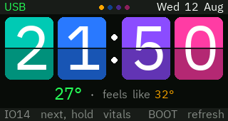
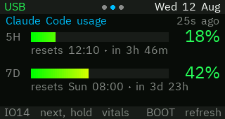
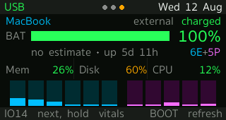
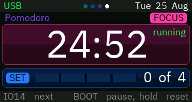
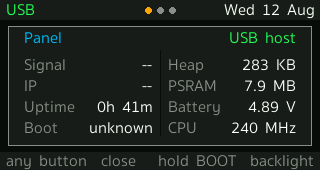

# T-Display-S3 desk panel

A LilyGO T-Display-S3 on a desk, showing the handful of things worth a glance
while you work: the time and the weather, how much of the Claude Code usage
window is left, what the Mac beside it is doing, a pomodoro timer that is the
panel's own rather than another window on the machine you are concentrating on,
and a banner the Mac can raise when something actually needs you.

It runs off the USB-C cable with no WiFi at all — the host does the fetching on
the panel's behalf over the same serial link that carries the console. WiFi is
there as a fallback, not a requirement.

| | |
|---|---|
|  |  |
| **flip** — a split-flap clock, and how warm it is | **usage** — the 5h and 7d windows, and when they roll |
|  |  |
| **mac** — charge, screen, memory, disk, a column per core | **pomo** — 25 on, 5 off, and how far into the set you are |
|  | |
| **vitals** — not a page: hold `IO14` for the panel's own | |

`IO14` moves to the next page, and held, brings up the panel's own vitals over
whatever is showing. `BOOT` refreshes the page in front of you, and held, dims
or brightens the panel — except on **pomo**, where there is nothing to fetch
and both halves of the button belong to the timer.

There was a second clock page — **now**, carrying the time again in a 64px
face with the full date, the conditions and the place beside it. The argument
for keeping it was that **flip** is what the panel rests on once the Mac's
screens go dark, and a page that has to be legible from the doorway at a
quarter brightness cannot also be the one holding a line of forecast in 16px
type. That argument was for the *reading*; it was never one for the *page*.
Half the cycle opened on the same clock, which is what you actually see
pressing `IO14`. So it is gone, and what that page alone carried went with it: the seconds, the spelled-out date, the conditions text
and the place name. The status bar still dates the panel, abbreviated, and the
temperature with feels-like is still under the flip clock — nothing that
answers a first question was on that page by itself.

A card that changes folds rather than simply becoming the new digit — the old
one down over the fresh half waiting underneath, then the new lower half up out
of the seam. Nothing rotates a bitmap: the leaf is the same card face drawn
through a viewport that closes onto the seam and opens again below it, dimming
as it goes, which at this size is what a fold looks like. It is the only thing
on the panel drawn as an animation rather than as a state, so it is also the
only thing that borrows a faster frame — 40 ms for the third of a second it is
in flight, and back to the usual once a second after.

The vitals are behind a hold rather than in the cycle because every figure on
them answers "is this thing working" — a question you ask on purpose after
noticing something wrong, never one you answer in a glance. As a page they cost
a press on every trip round to skip past three constants and two fields that
read `--` whenever the link is the cable. Any button closes the overlay and does
nothing else, which is also why its hint bar names no other button: an action
printed there would be one the press would not perform.

## Two questions, two ramps

The four colours of the flip clock's cards are the colours of the whole panel.
They started there because a split-flap board needs its cards told apart and a
`4` is not worse than a `3` — and that turned out to be the thing every other
page wanted too. The 7d window is not worse than the 5h one, disk is not worse
than memory, and a P core at 90% is not a warning; it is a P core doing its job.

So there are two ramps and they never overlap. **Teal, blue, violet, magenta**
says *which reading this is*: the card it is on, the chip that labels it, the
column it belongs to, the dot in the status bar you would press to get back to
it. **Green, orange, red** says *how that reading is doing*, and is kept for the
figures that are actually graded — the percentage, the temperature, the charge.
A page can then answer both at once, where colouring by severity alone left the
usage page as two identical grey rows and the Mac page as one long line divided
by hairlines.

Cards are what carry the first ramp. The same two-tone body as a flip card and
the same rounded corners, at a quarter of the strength, because a card with an
88px digit on it can be its hue at full and one carrying a bar, a percentage and
a line of small print has to sit behind all three. The label on it is the one
place the hue comes back at full: a dark word in a saturated lozenge, which is
also how the clock's own digits sit on their cards. Text on a card is drawn
transparent, blended against whatever is under it, which is what lets a string
cross the seam in the middle of a card without being boxed in the wrong half's
shade.

## How the pieces fit

```
   ┌─────────────────┐                       ┌──────────────────────────────┐
   │  T-Display-S3   │                       │            macOS             │
   │                 │   USB-C, CDC serial   │                              │
   │  dashboard  ────┼───────────────────────┤  usb_net_bridge.py           │
   │  net_link       │  @REQ / @RES framing  │    ├── PING  liveness        │
   │                 │                       │    ├── TIME  stands in for   │
   │                 │                       │    │         NTP            │
   │                 │                       │    └── GET   fetches on the  │
   └─────────────────┘                       │              panel's behalf  │
            │                                │              │               │
            │ WiFi, only if the bridge       │              ├─→ the internet│
            │ is not answering               │              │   (Open-Meteo)│
            └────────────────────────────────┤              │               │
                                             │              ├─→ :8787 usage │
                                             │              └─→ :8789 mac   │
                                             └──────────────────────────────┘
```

The panel does not know or care which link it got. `net_link.h` picks whichever
one is answering, preferring the cable; the status bar says which.

**Why a request bridge and not IP over USB.** The Arduino core's TinyUSB is built
without the NCM/ECM classes and its lwIP without PPP, so the panel has no way to
put packets on the cable. Moving *requests* instead needs nothing the stock core
does not already have.

**What a reply cut in half costs.** The framing is length-prefixed, so the reader
learns where a body ends from a header it has already passed. That is what lets a
JSON body carry newlines, and it is also the one thing on this link with no way
to notice that it is wrong: if the bytes stop halfway through — the Mac suspends
the bus mid-reply, the bridge loses the port between the header and the body —
the count never reaches zero. Every reply after it is eaten as filler, the panel
reads OFFLINE with the cable still in, and nothing recovers it, because the loop
task is still turning and the watchdog is watching the loop task.

It cost worse than that, too. `HWCDC` leaves `readBytes()` to `Stream`, which
spins for a full second waiting on a byte that a truncated body is never going to
send, without yielding — two of those a pass through `loop()`, and the panel is
polling its buttons at 0.5 Hz, which is slower than a debounce can see a finger.
A stale panel and a dead one look identical from a chair.

So the body is read with `read()`, which returns what is in the queue and nothing
more, and any frame still unfinished two seconds after it started is abandoned
with a `[net] resync` line to the console. A header that does not parse is
swallowed the same way rather than falling through to the console, where its
body would have been read as keystrokes — and `S` there dumps the framebuffer.
The panel also pings now without first asking `HWCDC` whether the host is there:
that flag is inferred from SOF interrupts, it can latch false across a suspend,
and the bridge only ever speaks when spoken to.

## Hardware

LilyGO T-Display-S3 — ESP32-S3 with 16 MB flash and 8 MB PSRAM, driving a
320×170 ST7789 over an 8-bit parallel (i8080) bus. No wiring: every pin is fixed
on the board and declared in `platformio.ini`.

Two things about it that cost an evening each if you don't know them:

- **GPIO15 gates the LCD rail.** It must be driven high before `tft.init()` or
  the panel never lights up, whatever else is right.
- **The display setup lives in `build_flags`,** not in TFT_eSPI's `User_Setup.h`.
  `-DUSER_SETUP_LOADED` tells the library to use ours. Editing `User_Setup.h`
  under `.pio/libdeps/` does nothing and is erased on the next dependency fetch.

## Getting it running

```bash
python3 -m venv .venv && .venv/bin/pip install platformio pyserial pillow freetype-py
cp include/secrets.h.example include/secrets.h    # then edit it
.venv/bin/pio run -e dashboard -t upload
```

`secrets.h` holds the WiFi credentials, where the two host servers live, and the
location and timezone for the clock and weather. It is gitignored; the example
beside it is not. Leaving the WiFi placeholders as they are is a supported
configuration — the panel then runs on the cable alone.

There is a second environment for bringing up a new board:

```bash
.venv/bin/pio run -e selftest -t upload      # backlight, colour, bus, buttons
```

## The host side

Four Python programs, all installed as launch agents. The plists sit beside
each script and carry their own install instructions in a comment at the top.

| | port | what it does |
|---|---|---|
| `tools/usb_net_bridge.py` | 8788 | Answers the panel's requests over the cable. Needs pyserial; **replaces** `pio device monitor`, since it holds the port. |
| `tools/usage_server.py` | 8787 | Serves the 5h/7d limits, out of two local files — and out of the API itself while the panel is showing that page. Stdlib only. |
| `tools/desktop_usage_probe.py` | — | Not a server: every 60s, mirrors the Claude desktop app's own usage reading into a second cache, so `usage_server.py` has something to fall back on once a CLI session ends. Stdlib only. |
| `tools/mac_stats_server.py` | 8789 | Serves battery, load, memory, disk, which screen is being driven, how long since anyone touched the machine, per-core CPU, and the notification mailbox. Stdlib only. |

The two servers run on the **system** python on purpose — stdlib only, so they
keep working when the project venv is rebuilt or deleted. Same for the probe,
which isn't a server but keeps to the rule anyway.

### Where the usage numbers come from

Three sources. Two are files something else on this machine already writes and
the server picks between them; the third is the API, asked directly, and only
while the usage page is the page in front of you.

```
  a Claude Code session              the Claude desktop app
  (a terminal, live)                 (running in the background)
          │                                    │
          │ statusline.sh, on every render     │ polls its own plan usage,
          ▼                                    ▼ roughly every 15 min
  ~/.claude/                         ~/Library/Application Support/Claude/
    statusline-usage.cache             plan-usage-history.json
    5h%  reset  7d%  reset             {"u":{"fh":6,"sd":2}}, per org
          │                                    │
          │                                    │ desktop_usage_probe.py, 60s
          │                                    ▼
          │                          ~/.claude/
          │                            statusline-usage-desktop.cache
          │                            5h%  0  7d%  0
          │                                    │
          └────────────────┬───────────────────┘
                           ▼
                   usage_server.py  :8787  ──→  the panel
                           │                     ▲
                           │  /usage?live=1      │  only from the usage page
                           ▼
            api.anthropic.com/api/oauth/usage, Claude Code's own token
```

The **fresher of the two files wins**, which lands the right way round on its
own: a live session rewrites its cache every render, so it beats a desktop
reading that is minutes old, and the moment the terminal closes the desktop one
takes over instead of the panel freezing on whatever the session last left
behind. A live reading, when there is one, beats both — it is seconds old and
it is the only source that states both reset times itself.

Two details that are not obvious and were both bugs first:

- **The samples name their org, and an account can have more than one.** This
  machine's history carries thousands for the org actually in use and a single
  stray from another, reading 0%/0%. Taking simply the newest sample serves that
  zero for as long as it happens to be last — a panel confidently reporting an
  empty quota against a window nowhere near it. The org with the most samples is
  the one taken, by the probe and by the live path, which needs the same answer
  to know which organisation to ask about.
- **The desktop history records no reset time**, so the countdown disappeared
  whenever that source won. A reset is an absolute epoch, so one still in the
  future describes the window in progress however old the file it came from; a
  missing reset is borrowed from the other cache when it has not passed yet.

The probe backdates its cache's mtime to when the desktop app took the reading,
not when the probe ran, so the `age` the panel shows is honest.

**Off the usage page, the reading is a floor and `age` is how far back it was
taken.** The desktop app records a sample roughly every fifteen minutes. So the
files trail the true number for as long as you are working. Measured on an
ordinary morning:

```
  08:50   14%
  09:05   17%      +3
  09:20   21%      +4
```

At that rate an eight-minute-old sample is two or three percent behind. Polling
the probe harder does nothing about it: it re-reads a file that has not changed,
and the app's own HTTP cache — which does hold a full response, reset times and
all — is rewritten by that same poll and no fresher. The ceiling is the app's
cadence, and there is nothing on the machine to switch to that beats it: its
Local Storage and IndexedDB carry no usage, and Claude Code's transcripts do
not record rate limits either.

With the app and Claude Code both closed nothing samples at all, and the files
age rather than update. The panel says how old the number is rather than
implying it is live, and the age goes warm once it is old enough to be worth
distrusting.

### The live reading

The number with no lag in it is the one the API will state on being asked, so
the server asks — the endpoint Claude Code's own `/usage` command calls:

```
GET https://api.anthropic.com/api/oauth/usage      Authorization: Bearer …
{"five_hour": {"utilization": 37.0, "resets_at": "…"}, "seven_day": {…}}
```

The credential is the one Claude Code itself signed in with. That endpoint
wants a token scoped `user:profile`; the long-lived kind `claude setup-token`
mints is scoped for inference alone and is turned away with a scope error, so
the one token on the machine that works is the CLI's own — which is why `/usage`
works there. On macOS it is in the login keychain as **Claude Code-credentials**,
and reading it needs the keychain's permission the first time (the plist beside
the server says how to answer that once). Where there is no keychain the CLI
keeps it at `~/.claude/.credentials.json`, read instead.

The first version here only read that credential, on the reasoning that the CLI
refreshes it whenever it runs and this could ride along. It cannot: an access
token lasts hours, the CLI refreshes when the CLI decides it needs to, and a
morning that starts at the panel rather than at a terminal finds the stored
token expired. The live reading then goes dark and stays dark, and the panel
serves the desktop cache's quarter of an hour of lag without saying so. So the
server renews it the way the CLI does — the `refresh_token` grant against
`platform.claude.com/v1/oauth/token`, as the same client — and puts the result
back in the same keychain item under the same account.

Writing back is the part to be careful about, because the grant rotates: the
response carries a new refresh token and the old one is spent from that moment,
so dropping it takes Claude Code's own login with it. Two things guard that.
The store is tested first, with the credential unchanged — if the keychain will
not take it, the renewal stops while nothing has been spent, which is also what
makes a missing keychain grant harmless. And what comes back is written before
it is used, so the copy on disk is never the older half of the pair. A renewal
is attempted only when the stored token is spent, never on a schedule, and at
most once a minute.

The request carries `anthropic-beta: oauth-2025-04-20`, the header that has the
API read a Bearer as an OAuth token rather than an API key — a documented flag,
not a disguise.

Two roads not taken, and why. **`claude setup-token`** is the obvious one, but
its token is inference-scoped and this endpoint refuses it. **The desktop app's
session cookie** was the first: it polls `claude.ai/api/organizations/<org>/usage`
with a cookie kept in its own encrypted store, readable on this machine — but
claude.ai sits behind Cloudflare, which refuses anything that does not look like
a browser, and getting through means sending the app's user agent and the
clearance cookies minted against it. That is a program claiming to be another
program to pass a control built to stop exactly that, so it is not here. The
CLI's token needs none of it and goes to a host meant for programs.

It is a credential, so it is fenced:

- **Only from the page.** The panel sets `?live=1` only while the usage page is
  what is on screen — not behind the vitals overlay, not from the other two
  pages. Off it the same request is answered from the files, as before. The
  panel still polls from every page, because whether to raise this page at all
  is decided from that reading.
- **At most one call every 25 seconds**, and one that fails stands back for two
  minutes rather than retrying on every poll.
- **Every failure falls back to the files.** No credential, a refresh token
  itself expired, no network, a changed endpoint: the panel shows what it did,
  seventeen minutes old and saying so. The live path can be entirely broken
  without the page being.

Arriving on the page asks immediately rather than waiting out the poll interval,
and the age in the corner reads `live` instead of counting seconds — it is the
page being open that makes it live, and it stops being that when you leave.

One thing it is not: a documented API. `/api/oauth/usage` is what the CLI
happens to call, and it can change or start refusing without notice. That is
what the fallback is for.

### Who they answer

This is about the two servers. The bridge listens on loopback only, and the
probe listens on nothing at all — it writes a file and exits.

Both servers bind all interfaces, because the panel's WiFi fallback needs to
reach them from the LAN. What that used to mean is that anything else on the network could
read them too — including `/notify`, whose text names project directories and
whatever Claude stopped to ask about.

So requests from **this machine** are served as they always were, which covers
every request over the USB bridge: the bridge does the fetching, so it arrives
from loopback. Requests from **the LAN** must carry `X-Panel-Token`. Posting a
notification stays loopback-only regardless.

The token is minted on first run and kept at `~/.config/t-display-s3/token`,
mode 0600, outside the repo. Copy it into `secrets.h` as `HOST_TOKEN` to let the
WiFi fallback work; leave the placeholder and the panel simply runs on the cable
alone. Clock and weather are unaffected either way — neither touches your
machine.

It is a shared secret over plain HTTP, so it is no defence against someone
reading the traffic, and is not meant to be. It stops the network being able to
just read the port.

All four run a *copy* of their script, from `~/Library/Application Support/`,
because `~/Desktop` is TCC-protected and a launch agent pointed straight at it
dies on startup with "Operation not permitted". **After editing one, copy it
across and kick the agent** — the plist comments give the exact commands. The
copy is what actually runs, so an edit left in the repo changes nothing and
looks exactly like a fix that did not work.

### The two scripts that live in ~/.claude

These are installed outside the repo but the panel depends on them, so copies
are kept here:

- **`tools/statusline.sh`** — the Claude Code status line. It writes
  `~/.claude/statusline-usage.cache`, which is the only place the usage numbers
  survive outside a running session — and therefore goes stale the moment the
  terminal closes, even while the desktop app keeps reporting the same
  account's usage in the background. `desktop_usage_probe.py` mirrors that
  into `~/.claude/statusline-usage-desktop.cache`, same four-field shape but
  with the resets always `0` since the desktop app's own history never
  records one. `usage_server.py` reads both and keeps whichever was written
  more recently. No cache at all, and the usage page shows nothing.
- **`tools/panel-notify.sh`** — wired to four Claude Code hooks; raises and
  retracts the banner. This is what makes the banner worth having. Its alerts
  carry a one-minute `ttl`: the thing they are waiting for is you answering in
  the terminal, and the retracting hooks catch that within a keystroke, so the
  only case the banner outlives is the one where nobody is coming.

Copy them to `~/.claude/` and point `settings.json` at them.

### The panel on a phone

`tools/panel_web/` is the panel again, as one web page, for the times it is not
the thing in front of you. Double-click **`desk-panel.command`** in Finder and
open the address it prints on the phone; close that Terminal window and it is
gone. No launch agent, nothing left listening.

Run `tools/panel_web/install.sh` once first, from a shell that can read this
repo. It is the wall the launch agent for `usage_server.py` hit, in a new
place: `~/Desktop` is TCC-protected, Terminal is not granted it, and a
`.command` opened from Finder is granted the file that was clicked and nothing
else beside it. So out of the repo the launcher starts and then cannot read
`serve.py` sitting next to it — an `EPERM` on `open`, which no mode bit
explains and no `chmod` moves. The installer puts the copy that actually runs
under `~/Library/Application Support/`, which nothing guards, and the launcher
falls through to it. Double-click the one in there; an *alias* of it will
follow, a copy on the Desktop lands back behind the same wall. Re-run the
installer after editing either file, or after moving house — the installed copy
is a copy, and `panel.json`, which is where `WEATHER_LAT` and the rest end up
once `include/secrets.h` is out of reach, is copied at the same moment.

It is a second view, not a second source. `usage_server.py` and
`mac_stats_server.py` already hold the readings and are already up, so
`serve.py` serves one HTML file and fetches from them on the page's behalf —
the same errand `usb_net_bridge.py` runs for the panel, and it holds each
reading for as long as the panel would, so a page polling every two seconds
costs one loopback request at most and usually none. Going through it is not a
convenience. Both servers refuse requests from off the machine without
`X-Panel-Token` and a browser opening a URL cannot send a header; and a page on
`:8791` fetching `:8787` is cross-origin, which neither server sends the
headers to permit. Fetched from the server the page came from, both questions
stop being asked and the token never leaves the Mac. The weather goes the same
way for a third reason: a phone on the Mac's own hotspot has no route to the
internet, and the Mac does.

The page is the panel: a 320-wide canvas drawn with the arithmetic in
`main.cpp`, colours kept in RGB565 until they are written out so `shade()`
there rounds where `shade()` here does, the type served off the same server as
the face the `.vlw` fonts were baked from, and the fold when a minute turns
borrowing a faster frame for the third of a second it is in flight exactly as
the panel does.

What differs is the height, and it is the only thing that had to. The panel has
320×170 and shows one page of four; a phone has the room for three of them at
once, so the clock, the two windows and the Mac are stacked rather than cycled —
and the page dots that said which page you were on went with the cycling. Three
smaller things follow from being a phone rather than a panel: the status bar
says `HTTP` or `OFFLINE` where the panel says `USB` or `WiFi`; the hint bar
names a tap, because the buttons it would otherwise name are not on the thing
you are holding; and the panel's own vitals are not there and cannot be, since
the heap, the PSRAM, the RSSI and the boot reason are the ESP32's and nothing
on this side knows them. The pomodoro is not there either, for a better reason
than room — it is the one page holding a state of its own, and a second copy of
that state on a phone would be a second timer, not a second view of one.

What the phone gets it gets over plain HTTP with no token, so anyone on the
network can read it: the usage percentages, the reset times, and this Mac's
charge, memory, disk and cores. Posting a notification is not on this server at
all. It needs the Mac awake — a dark screen is fine, a sleeping machine is not.

## The pomodoro page

The only page here holding a state of its own. Every other one is a window onto
a machine somewhere — the sky, the Mac, the API's idea of how much of the week
is left — and this one is a thing the panel knows and nothing else does.

It is on the panel rather than in a window on the Mac for the reason the clock
is: a timer on the machine you are working on gets covered up by the work, and
one that raises a notification there is one more thing interrupting the screen
you are trying to concentrate on. Beside the keyboard it is read the way a wall
clock is, by looking at it, and when it does want you it has a backlight to
flash and a screen nothing else is using.

Twenty-five minutes of work, five off, a quarter of an hour after the fourth.
Constants rather than settings — there is no keyboard on this board to change
them with, and a length you can talk yourself into extending is not a timer.

| | |
|---|---|
| `BOOT` | start, pause, resume |
| hold `BOOT` | reset the phase — or skip it, if nobody has started it yet |
| keep holding, 3s | clear the set: back to a first block, not yet started |

Two actions on one hold, told apart by what the timer is already doing, and the
hint bar names the one it is about to do so the pair is read off the screen
rather than remembered. A phase with time spent on it goes back to full; one
nobody has touched is skipped instead, which is how the break you do not want,
or the block you already did away from the desk, gets out of the way. Both are
behind the hold because both throw something away. `P` on the console is the
press, for a host that wants to drive it.

**The set is on the same hold, further down.** Neither action above it touches
the count, and the count clears itself in exactly one place — the far side of
the long break. Since a skip does not earn its block, a set abandoned at two
could not be walked to that place either: it had no way back to the beginning
short of pulling the cable, on the one page here holding a state of its own.
Three seconds in, the whole set goes. Deeper on the same hold rather than on a
gesture of its own, because it is the same kind of act as the two above it and
throws away more than either — and depth is the axis this page already sorts
those by. At the first stop the hint bar stops naming the hold and starts naming
the stop below it, which is the only reason a second stop is findable at all.
`R` on the console does it without the finger.

**A rest starts itself and a block of work does not.** That is the one asymmetry
here and the useful one: five minutes that begin when you notice the banner are
not five minutes off, so the break goes on the clock the moment the work ends —
while work that begins because a timer said so is work begun while you are still
in the kitchen, so the next block waits for a finger.

The end of a phase raises the same banner the Mac's notifications use, flashing
the backlight, coloured for the phase that is *starting* rather than by severity
— which is the whole reason the timer belongs on a panel with a backlight rather
than in a window. Teal means get up, magenta means sit down, and both read
before the words do.

The page itself is two cards and they answer two questions. The top one is the
phase and what is left of it, in the 64px face nothing had had a use for since
the plain clock page was merged away; the bottom one is the set, four cells
filling as the afternoon goes, which is the thing a pomodoro timer knows and a
clock does not. Their hues are deliberately different: the top card runs magenta
to teal to violet as the phase turns over, and the set stays blue underneath it,
because a set does not change colour halfway through.

The countdown is white while it runs, dim before it has been started, and blinks
between the two while it is paused — a stopped countdown otherwise looks exactly
like one nobody has started. The last minute goes warm, which is the severity
ramp doing its usual job on the same page as the other one.

## Notifications

`mac_stats_server.py` holds one message. Anything on the machine can post one
and the panel raises it over whatever page is showing, flashing the backlight,
until a button acknowledges it:

```bash
curl -sf -X POST localhost:8789/notify -d 'msg=build failed' -d kind=warn -d ttl=30
```

`kind` is `info`, `warn` or `alert` and picks the colour. The panel raises two
of its own over the same mechanism, which is why a fourth kind exists that the
host cannot post: a restart nobody asked for, and the end of a pomodoro phase —
that one carrying its own hue, because what is worth knowing before the words
are read is which phase is starting and not how much it matters. `ttl` is seconds, `0`
meaning until dismissed — the default for `alert`, which is the difference
between an alert and a note. Nothing waits forever even so: a banner with no
`ttl` of its own is taken down after ten minutes, and one that runs out
unanswered puts the panel back on its resting page rather than leaving it on
whatever the banner was covering. Posting an empty message retracts. Posting is
loopback-only; everything else the server does is read-only and served to the
subnet.

Messages are squeezed to printable ASCII, because that is all the fonts carry.

## Fonts

The four smooth fonts are generated from IBM Plex Sans Thai — vendored at
`tools/fonts/` under the SIL Open Font License — into TFT_eSPI's VLW format, and
checked in as C headers:

```bash
F=tools/fonts/IBMPlexSansThai-Regular.ttf
.venv/bin/python tools/make_vlw.py $F 16 src/fonts/ui16.h   UiFont16   --set ascii
.venv/bin/python tools/make_vlw.py $F 24 src/fonts/ui24.h   UiFont24   --set ascii
.venv/bin/python tools/make_vlw.py $F 64 src/fonts/big64.h  BigFont64  --set numeric
.venv/bin/python tools/make_vlw.py $F 88 src/fonts/flip88.h FlipFont88 --set numeric
.venv/bin/python tools/preview_vlw.py src/fonts/ui16.vlw /tmp/ui16.png "20:45  28°"
```

`--set numeric` is why the two big faces cost what they do and not more: the
flip clock only ever shows a digit or a dash, so baking the other ninety-odd
printable characters at 88px would be 37 KB of flash spent on glyphs nothing
can reach.

The font sits in the repo rather than being named as a path into
`/System/Library`. It used to be macOS's Sukhumvit Set, which made the headers
something only a Mac could regenerate and the glyphs inside them something
nobody could redistribute. Plex Sans Thai is one file carrying both the Latin
the panel shows and the Thai below, and the licence lets it travel with the
source.

`make_vlw.py` writes the raw `.vlw` beside the header so `preview_vlw.py` can
check what was actually emitted rather than re-deriving it from the TTF. Only
the headers are checked in — the `.vlw` files are build byproducts and
gitignored, so regenerate before previewing a fresh clone.

The glyph set is printable ASCII plus the degree sign. That is a real constraint
and it reaches further than it looks: the middle dots on the usage and Mac pages
are *drawn* rather than typed, and `mac_stats_server.py` substitutes non-ASCII
out of notification text before storing it.

Thai works, but only with a font whose combining marks already carry
`xAdvance == 0` and a negative `dX` — TFT_eSPI does no OpenType shaping. Plex
Sans Thai does, and so did Sukhumvit Set; Thonburi does not. The zero-advance
count `make_vlw.py` prints on the way out is that test in one number — a Thai
set reporting none will not stack. See the comment in `make_vlw.py`.

## Talking to a running panel

The firmware takes single-byte commands on the console, and
`tools/grab_screen.py` uses them to pull the actual framebuffer — not a mock-up
of it — as a PNG:

```bash
.venv/bin/python tools/grab_screen.py shot 4      # capture all four pages
```

It captures from wherever the panel is rather than from the first page, so which
page lands in `shot0.png` is whichever one it was resting on — the usage page
while somebody is at the Mac, the flip clock once nobody is.

| | |
|---|---|
| `N` | next page |
| `S` | dump the framebuffer as raw RGB565 |
| `A` | toggle automatic page selection |
| `V` | toggle the vitals overlay |
| `P` | start or pause the pomodoro timer |
| `R` | clear the pomodoro set |

`V`, `P` and `R` exist because their own way in is a finger on a button, which
is no use to a host trying to photograph an overlay or a timer mid-count — or
one that wants the set at a known count before it starts.

While the bridge is running it owns the serial port, so `grab_screen.py` talks
to the bridge's passthrough socket instead. Uploads pause the bridge
automatically — `pio_bridge_pause.py` is registered as a pre-upload hook in
`platformio.ini`, so `pio run -t upload` just works with the bridge up.

## Tests

```bash
./tests/run.sh
```

No board, no PlatformIO — just a C++17 compiler. It covers `layout.h`, which is
where the two pieces of arithmetic worth being wrong about live: the banner's
word wrap and the core columns' sizing.

Two things make it worth having rather than decorative.

It tests the **firmware's own code**. `layout.h` is templated on the string type
and on the function that measures text, which are the only two things that
cannot leave the device, so the test compiles the same header the panel does
rather than a copy that quietly drifts.

And it measures text with **TFT_eSPI's real algorithm over the real fonts** —
`textWidth` transcribed from the library, reading metrics out of the generated
`.vlw` files. That is not pedantry: the width of a string is not the sum of its
characters' widths. The first glyph's negative left bearing is added back and
the last contributes its ink extent rather than its advance, so a wrap checked
against a simpler model passes on the host and overflows on the panel.

What it asserts, over a corpus and 200,000 random inputs at the banner's real
280px: no line exceeds its box, no line is empty or carries a stray space, the
line count is respected, and the characters that come out are the characters
that went in — entire when the text fitted, a prefix when it was cut, with the
loss marked. Then that every core count from 1 to `MAX_CORES` lands on the panel
in full, and that eleven cores still come out at the 22px this was built around.

The suite has been checked against deliberate breakage — lines allowed to run
over, bars pinned back to a fixed width, the truncation marker dropped, a
character lost per word, a stray separator, an off-by-one on the line limit —
and each is caught by a different assertion.

The `.vlw` files are gitignored build byproducts; regenerate them with
`make_vlw.py` before running the tests on a fresh clone. The test says so if
they are missing.

## What the panel decides for itself

It picks its own page: to the Mac page, where the core columns are, when that
machine's load passes three quarters of its core count, and to the usage page
when a window goes over 85%. Any button
hands control back for two minutes; `A` turns it off entirely. The lit dot in
the status bar says which mode it is in — cyan for automatic, warm while you
have it, white when automatic is off. The four dots are otherwise the four
pages in their own colours, so hue says which dot is which page, brightness says
which one you are on, and the colour of the one you are on says who is choosing
it.

It also picks where to rest, off the same fact the brightness carries: the usage
page while somebody is at the Mac, the flip clock once nobody is. The two states
are read by a person doing different things. A dark Mac means nobody is working,
and the clock is the only thing on this panel still moving; a Mac whose screen has
just come on means somebody sat down, and what is left of the 5h window is the
first thing that changes what they do next. So the wake is the panel's cue to
have the usage figures already up, before anyone asks for them.

"Nobody is at it" is three conditions, and it takes only one: the readings
stopped arriving, **or** they are still arriving and every screen over there is
off, **or** the screens are on and nothing over there has been touched in ten
minutes.

The second earns its keep at night. The screens idle out after ten minutes, but
a couple of the apps that live on this Mac hold sleep assertions, so the machine
itself answers all night — and on the answering test alone the panel sat on the
Claude usage page at three-quarter brightness in a dark room, saying somebody
was working. Even a Mac that really is asleep dark-wakes for maintenance every
fifteen minutes with Power Nap on, and each of those was another minute and a
half of the same. The screen going dark is also the whole of what a person sees
when they say the Mac went to sleep, so it is the honest thing to follow.

The third earns its keep during the day, and it exists because the second is not
the whole of the question. This Mac wakes itself out of deep sleep for a
notification, lights the screens for anything between a second and half a minute
with nobody in the room, and goes back to sleep: seven of the twenty full wakes
in the week this was written, three of them in one afternoon, against six the
machine was woken for on purpose. Every one of those was the panel jumping off
the clock onto the usage page at three-quarter brightness, on a desk nobody was
sitting at, for as long as the wake lasted plus the thirty seconds it takes the
reading to go stale — the same complaint the screen reading was added to answer,
arriving through the other door. The screens coming on says the machine woke.
Only a keyboard or a mouse says a person did.

So the question is put to the HID clock, which is the one thing a wake for a
notification cannot fake. `mac_stats_server.py` reports wall-clock seconds since
the last keyboard or mouse event rather than the counter itself, because that
counter freezes while the machine sleeps: it says "fifty-five seconds" on the
way out of a fifteen-minute nap, which is exactly the answer that would make the
wake look like somebody sitting down. What survives the freeze is the moment of
the last event, so that is what it keeps, and it moves it only when the counter
runs backwards — which nothing but a real event does.

Ten minutes because that is this Mac's own display-sleep timeout: inside it, the
screens being on is the machine agreeing that somebody is here, so in ordinary
use the two fire together and the reading changes nothing. Past it the screens
are on for something else — a wake nobody asked for, or a film holding the
display awake, and a film is not work the usage page has anything to say about.
Either way the panel rests on the clock, and the first touch of the mouse brings
it back inside a poll.

That is a floor, not an interruption: the crossing moves where automatic falls
back to, rather than borrowing the screen and handing it back. Both alert
conditions above are ignored once the readings stop — they are made of numbers
that stopped arriving, so a full window found then is a reading from before it
went, and leaving the clock for it would be old news presented as if it had just
happened, at exactly the hours the clock is what the panel is for.

A pomodoro outranks both — running, or loaded and still inside the ten minutes
it waits for a finger in — and is the only page here chosen by something the
panel was *told* rather than something it observed: somebody pressed a
button to start it, which is a stronger statement about what is worth showing
than any reading off the Mac, and the minutes left are what they pressed it to
be able to see. It gives the page back when the clock stops, or ten minutes
after a phase left waiting to be started gives up waiting. The same fact lifts
the brightness — a machine can be woken by a notification, while a pomodoro only
starts because a finger started it, so it is the better evidence of the two that
somebody is here.

Both raises above stand aside for it too, and the full window is why. It stays
true for hours and its return path waits on the condition passing rather than on
any clock, so a raise landing three minutes into a block of work held the panel
on the usage page for the remaining twenty-two and handed the countdown back
after the banner had already announced the block was over.

They stand aside for the waiting phase as well as the running one, which matters
more than it sounds: a phase loaded and waiting needs the page more than a
running one does, not less. A running clock only wants watching; a waiting one
wants pressing, and BOOT is the timer's button on this page alone — anywhere
else in the cycle it is the refresh. Standing aside only for a running clock
left the gap exactly where the break is: the panel came back to rest on the
timer when the break-over banner went down, was pulled off it on the very next
pass, and the press meant to start the next block landed on a page that answered
it by refetching something.

The conditions are cleared rather than stepped around, so anything still true
when the timer lets go is raised then — as far as the raises are concerned, the
timer letting go is the condition arriving. Letting go is the clock stopping, a
phase paused by hand, or a phase nobody came back to start running out its ten
minutes of holding the page.

The two part company below that. The core columns go up on the answering test
alone, because an unattended build on a Mac with its screens off is running
*now*, and that is worth raising for whoever comes back to find out what it did.
The full window goes up only when somebody is actually there: it raises the very
page the floor has just left, and it is the one condition here that stays true
for hours — long enough to hold the panel on a bright page all evening over a
threshold crossed while nobody was in the room. A crossing that lands during a
banner or a manual hold waits for it, and if the Mac woke and went dark again in
between, only where it ended up is arrived on.

A banner that times out unanswered arrives at that same resting page, and for
the same reason the floor exists at all: whatever page it was covering was
chosen by something that is over, and nobody stayed to want this one. A banner
you take down with a button is the opposite case and is left alone — someone is
standing at the panel, and the page they are on is theirs.

It sets its own brightness, and that level says the same thing on the one channel
you take in without reading anything: 75% of full while somebody is at the Mac,
25% once nobody is. Across a room, at an angle, out of the corner of an eye — it
carries the fact before you have decided to look, and the page you find when you
do look agrees with it.

It never blanks at the low end. The hours the Mac is away are exactly the hours
nothing else on the desk is showing the time.

This used to follow sunset instead, off the sunrise and sunset in the forecast,
which was the wrong axis twice over: it dimmed the panel at eight in the evening
while you were still sitting there working, and left it bright all night
whenever the sky was the only thing that had changed. Keyed on the Mac it still
dims when you go to bed — the screen going dark is what going to bed looks
like — without the panel needing to know the hour, and a machine left running
overnight on a long build dims along with it. Hold `BOOT` to override the level
by hand; it lifts by itself the next time the automatic one moves.

And it restarts itself if it wedges. The ESP32's task watchdog watches the loop
task at a 30-second timeout — generous on purpose, because the longest thing
loop() legitimately does is a weather fetch over WiFi, which blocks inside
HTTPClient where there is no callback to feed from. A watchdog that trips on a
slow morning is one that gets switched off. Requests over the USB link are fed
throughout by the same idle hook that keeps the clock moving.

That budget is spent per *request*, and it took a restart to make the
distinction. Thirty seconds was measured against one blocking fetch of about
eight, but a pass can carry five: the four host services and the forecast come
due on timers of their own and coincide by arithmetic, and a link that has just
come up clears three of them together on purpose — so the pass right after the
USB bridge stands down for an upload chains them by design. On the radio, with
the Mac's LAN address answering nothing, that is four connect timeouts and a TLS
handshake with nothing feeding anything, and the panel restarted itself for
doing its job. So the WiFi path calls the same idle hook on the way into each
request and on the way out. The clock still stops for the length of a request;
what it no longer does is add five of them together against a budget sized for
one.

There is a second kind of wedge that watchdog is blind to by construction: the
loop still turning, the cable still in, and nothing at the other end answering.
`HWCDC` works out whether a host is there from SOF interrupts and an `IN_EMPTY`
it re-arms only once, so a suspend and a resume can leave it saying *not
connected* with the cable in and the bridge running — and a write in that state
is dropped rather than sent, so the panel stops asking, and the bridge only ever
speaks when spoken to. Nothing in the firmware can re-enumerate a USB device; a
restart can. Five minutes of silence from a bridge that *was* answering, with the
bus still ticking and the CDC insisting it is not connected, and the panel
restarts itself. It fires at most once per episode — after the restart nothing
has answered yet, and a panel that never had a bridge is not one that lost one —
and it stands down for a running pomodoro, which is state that exists nowhere
else.

A restart nobody at the desk asked for — either kind, the one it was forced into
and the one it chose — raises a banner, the same one the Mac uses to interrupt
you, because the alternative is learning nothing: a watchdog that
quietly recovers the panel at four in the morning leaves no other trace but an
uptime that went back to zero while nobody was looking. The reason stays in the
vitals overlay afterwards for as long as the panel is up. `panic = true`, so a
trip also leaves a decoded backtrace on the serial console on its way out.

## Telling whether the Mac is awake

The short answer is the **brightness**: full-ish means somebody is at that
machine, dim means nobody is — either it stopped answering, or it is answering
with every screen dark. That is a deliberate choice of channel — it is the only
thing here readable without looking directly at the panel. The rest of this
section is what the screen adds once you do look, and it separates the two
halves the brightness rolls together.

Two readings answer it in detail, and neither does it alone.

The **link name** in the status bar is the first. `usb_net_bridge.py` is a
process on the Mac, so a Mac that is asleep stops answering its pings; twelve
seconds of silence and the word flips to `WiFi`. Read the *word*, not the
colour — `WiFi` is green too, because `online()` only asks whether there is a
link at all. `USB` therefore means something on that machine was scheduled
within the last twelve seconds, which is as close to "awake" as the panel can
get from this side of the cable. The reverse does not hold: `WiFi` is equally
what an unplugged cable or a stopped bridge looks like.

Beside that word, and only once the panel has stopped believing anybody is at
the Mac, is **`sleep`**, blinking in red at half a second either way. It is the
one state here the panel will name out loud — and the one place the severity
ramp is spent on something that is not severe, because a Mac being asleep is the
ordinary state of that machine for two thirds of the day. The question it
answers is worth the loudness anyway: the panel dimming on its own is the
symptom of half a dozen things, and whether the machine really went under or the
panel merely lost sight of it is the one worth settling from across the room.

It is read off the screens rather than off the silence: the last thing the
Mac said about its displays, which a failed fetch leaves standing. That is what
carries it through the machine going all the way under — the screens go dark and
the Mac says so, and the host goes quiet some minutes later with that reading
still the most recent one. A sleeping Mac, seen from the desk, is a dark one
that then went away, in that order.

The two states it refuses are the point of having it. A machine left awake with
nobody touching it for ten minutes dims the panel too, and there is nothing
behind calling that sleep. A host that goes quiet with its screens last known
*on* is a bridge that died, a server that was restarted, or the sixty seconds an
upload holds the port — the Mac never said it was going anywhere, so neither
does the panel. Both show no word at all, which makes the absence worth reading
too: dim with nothing beside the link is the Mac awake with nobody at it.

The **screen word** on the Mac page is the second — `external`, `built-in`,
`screen off`. It comes from CoreGraphics rather than a shelled-out tool, which
is what makes it cheap enough to sample every five seconds; the reading it
replaces cost 25 ms of a 30 ms pass and was removed for it, where this one costs
88 microseconds. Note the asymmetry it covers: a Mac that is itself asleep
cannot answer at all, so `screen off` always means the machine is up and only
the display has gone dark. That state is invisible to the link, which still
reads `USB` throughout.

That word is the one thing on the page that is never allowed to go stale. Past
thirty seconds without a fresh reading it is replaced by `not answering` in
warm, because a charge figure a minute old is still roughly true while
`external` a minute after the Mac slept is simply false — and false in the
direction that matters, since it claims the machine is up. Thirty is chosen
against a known ceiling: the host resamples every five seconds and the panel
asks every ten, so a current reading cannot be older than fifteen.

Nothing new has to be probed for this. The panel already pings the bridge every
four seconds and gives up after twelve, which is a liveness check running on its
own processor, off USB power, against a process that has to be scheduled on the
Mac to answer at all. Do not be tempted to add a network probe instead: macOS
runs a Bonjour sleep proxy whose entire job is answering the network on behalf
of a sleeping Mac, so pinging over WiFi would report awake when it is not.

Together: `USB` plus a screen word is a Mac that is awake, and the word says
whether anyone is likely looking at it — which is the pair the resting page and
the brightness are built out of. `external` or `built-in` is somebody there;
`screen off` is a machine running with nobody at it, and reads dim on the clock
for the same reason a stopped one does. `not answering` means the panel asked
and got nothing — asleep, unplugged, or a stopped server, and it deliberately
does not guess which. If the clock and weather keep updating while only the
Mac-sourced pages go quiet, it is the Mac rather than the network, because the
forecast does not travel through it.

## Notes for later

Nothing outstanding. Things worth knowing about the shape of it:

- The LAN token is a shared secret over plain HTTP. It keeps the network from
  reading the ports; it would not survive someone watching the traffic. TLS
  would mean a certificate to mint and renew for a device with no clock at
  boot, which is a worse trade for what is on the wire.
- `net_link`'s idle hook cannot get *inside* the WiFi path. HTTPClient offers no
  callback, so the clock does stop for the length of a slow weather fetch on the
  radio; the hook is called either side of each request instead, which is enough
  to keep a pass carrying several of them inside the watchdog budget but is not
  the same as the panel staying live through one. The USB path has no such
  problem — it is fed from within its own wait.

## License

MIT — see [LICENSE](LICENSE). Two things in the tree are not mine to put under
it, and both are named where they sit:

- **`tools/fonts/IBMPlexSansThai-Regular.ttf`**, and the `src/fonts/*.h` headers
  rasterised out of it, are IBM Plex Sans Thai — © IBM Corp., SIL Open Font
  License, `tools/fonts/OFL.txt` beside it. The generator is mine and the glyphs
  are not; the OFL is what lets both sit in the same repo and be handed on.
- **`measure()` in `tests/layout_test.cpp`** is TFT_eSPI's `textWidth`
  transcribed line for line (© Bodmer, FreeBSD licence), which is the whole
  point of it: a width function re-derived from the spec would agree with the
  wrapper it is meant to be checking.

TFT_eSPI and ArduinoJson are fetched at build time, not vendored, and keep their
own terms.
